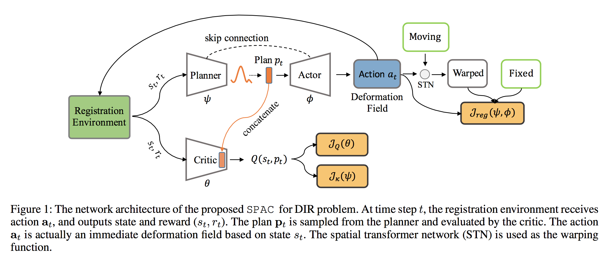
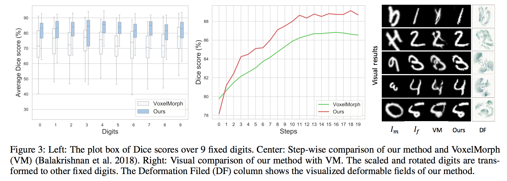
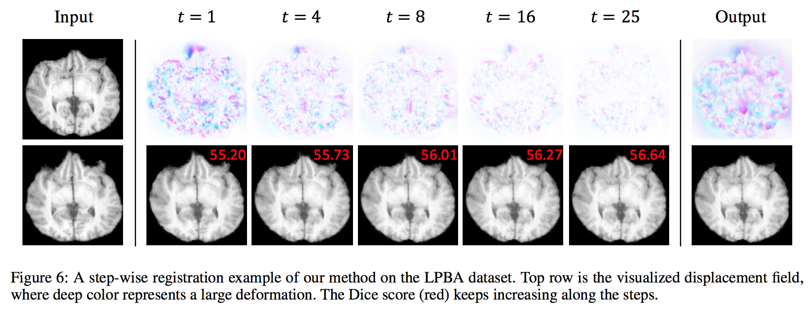

## Official PyTorch implementation of the [SPAC](https://arxiv.org/abs/2112.07415) "Stochastic Planner-Actor-Critic for Unsupervised Deformable Image Registration", AAAI 2022.  




## Requirements

- Version
	* python 3.6
	* pytorch 1.4

- Install requirements:

```setup
pip install -r requirements.txt
```


## Training

0. The core algorithm is in [brain.py](brain.py), and we build environment in [env.py](env.py). The [agent.py](agent.py) handles the logic of interactions.
1. Modify [config.py](config.py) to set path to data, iterations, and other parameters.
2. To train the model(s) in the paper, run this command:

```train
python main.py
```


## Evaluation

0. Set 'idx' parameter in [config.py](config.py) to choose existing models.
1. To test our model, run:

```test
python test.py
```


## Results





## Citations
If our code helps your research or work, please consider citing our paper.

```
@inproceedings{luo2022stochastic,
  title={Stochastic Planner-Actor-Critic for Unsupervised Deformable Image Registration},
  author={Luo, Ziwei and Hu, Jing and Wang, Xin and Hu, Shu and Kong, Bin and Yin, Youbing and Song, Qi and Wu, Xi and Lyu, Siwei},
  booktitle={Proceedings of the AAAI Conference on Artificial Intelligence},
  volume={36},
  number={2},
  pages={1917--1925},
  year={2022}
}

@inproceedings{Luo2021StochasticAF,
  title={Stochastic Actor-Executor-Critic for Image-to-Image Translation},
  author={Ziwei Luo and Jing Hu and Xin Wang and Siwei Lyu and Bin Kong and Youbing Yin and Qi Song and Xi Wu},
  booktitle={IJCAI},
  year={2021}
}
```

If you have any question, contact me: ziwei.ro@gmail.com
